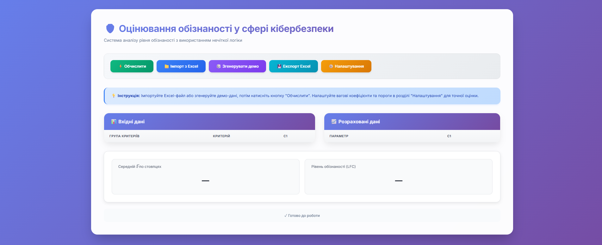

# 🧠 Як працює програма

## 🎯 Призначення

Система оцінювання рівня обізнаності у сфері кібербезпеки з використанням нечіткої логіки.

---
)

## 🧩 Основні компоненти

### 🔹 Імпорт даних

- Завантаження **Excel-файлу** з оцінками респондентів
- Підтримка множинних випадків (стовпці `c1`, `c2`, `c3`, `c4`…)
- Автоматичне розпізнавання груп критеріїв

### 🔹 Структура даних

- **G1** — основи кібербезпеки (7 критеріїв)
- **G2** — захист персональних даних (6 критеріїв)
- **G3** — виявлення кіберзагроз (5 критеріїв)
- **G4** — підвищення обізнаності та реагування (4 критерії)

---

## 🧮 Алгоритм обчислення

- **δ (дельта)** — сума оцінок критеріїв у групі
- **μ (мю)** — функція приналежності через квадратичний S-сплайн з порогами _(a, b, c)_
- **ϑ (тета)** — зважена агрегація: `ϑ = Σ(μᵢ × wᵢ)`, де _w_ — нормалізовані ваги
- **LFC (Level of Familiarity with Cybersecurity)** — лінгвістична оцінка на основі середнього `ϑ̅`

---

## 📊 Рівні LFC

| Рівень             | Діапазон      |
| ------------------ | ------------- |
| 🔹 Високий         | ϑ̅ > 0.8       |
| 🟢 Вище середнього | 0.6 < ϑ̅ ≤ 0.8 |
| 🟡 Середній        | 0.4 < ϑ̅ ≤ 0.6 |
| 🟠 Низький         | 0.2 < ϑ̅ ≤ 0.4 |
| 🔴 Дуже низький    | ϑ̅ ≤ 0.2       |

---

## ⚙️ Налаштування

- Вагові коефіцієнти **v₁–v₄** для кожної групи _(1–10)_
- Пороги **S-сплайну (a, b, c)** для кожної групи
- Збереження та застосування конфігурації

---

## 📤 Експорт результатів

- Збереження розрахунків у **Excel**
- Окремі листи для розрахунків та підсумку

---

## 🛠️ Технології

- **HTML5**, **CSS3**, **JavaScript (ES6+)**
- **SheetJS (xlsx)** — робота з Excel
- **Нечітка логіка** — оцінювання рівня кіберобізнаності
